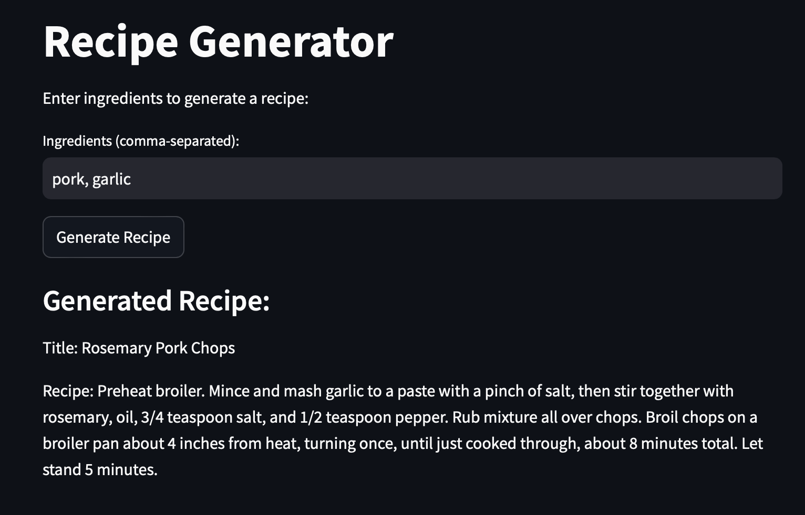

# Recipe Generator

Recipe generator is an AI-driven application built with **Streamlit** and **ChromaDB**. Users can input ingredients, and the application will return the most relevant recipe from a stored database using vector-based search.



## Features

- **Semantic Search**: The application leverages AI techniques for semantic search, enhancing the user experience through more accurate recipe suggestions.
- **ChromaDB Vector Store**: Recipes are embedded into a vector database for efficient, accurate retrieval.
- **Streamlit Interface**: Provides a user-friendly web interface for generating recipes.

## Data Source

The recipe data used in this project is sourced from a dataset available at [13k-recipes.csv](https://github.com/josephrmartinez/recipe-dataset/blob/main/13k-recipes.csv). Please check their repository for more details.

## Set-up
1. Install the required dependencies:
   ```bash
   pip install streamlit pandas chromadb tqdm
   ```

2. Run the Streamlit app:
   ```bash
   streamlit run app.py
   ```


